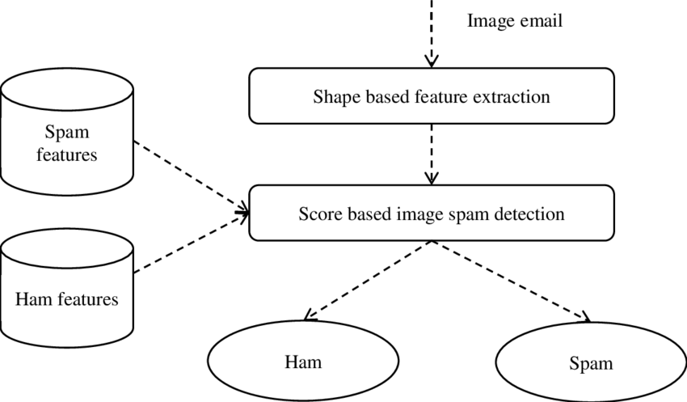

# spam_detection

Demo = https://v-it.in/Z65CL76B6

## Problem Statement
Email spam has become a serious issue in recent years, and as the number of internet
users grows, so does the number of spam emails. They are being used for unlawful and
immoral activities, such as phishing and fraud. Sending harmful links via spam emails,
which can destroy our system as well as get access to yours. Spammers can easily create
a fake profile and email account, and in their spam emails, they appear to be a real
person. These spammers target those who are unaware of the scams.

# Architecture

Machine learning methods of recent are being used to successfully detect
and filter spam emails. Some Methods are Content Based Filtering Technique, Case
Base Spam Filtering Method, Heuristic or Rule Based Spam Filtering Technique or
Previous Likeness Based Spam Filtering Technique.
# Solution

The system should be able to easily classify between real and fake emails.
You have to build a robust antispam filter solution that should identify fake and real emails.

#  Contributer
- Bhavya M Shah
